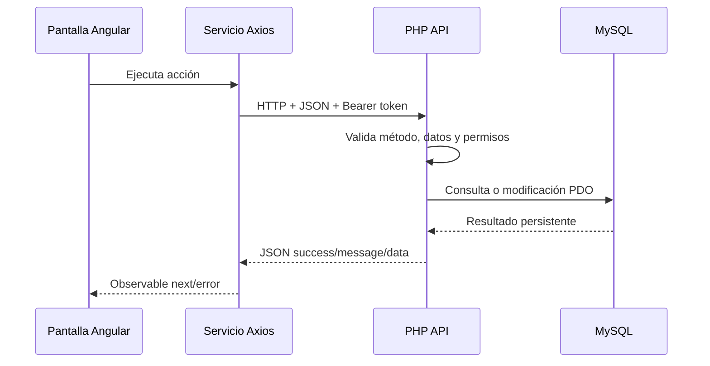
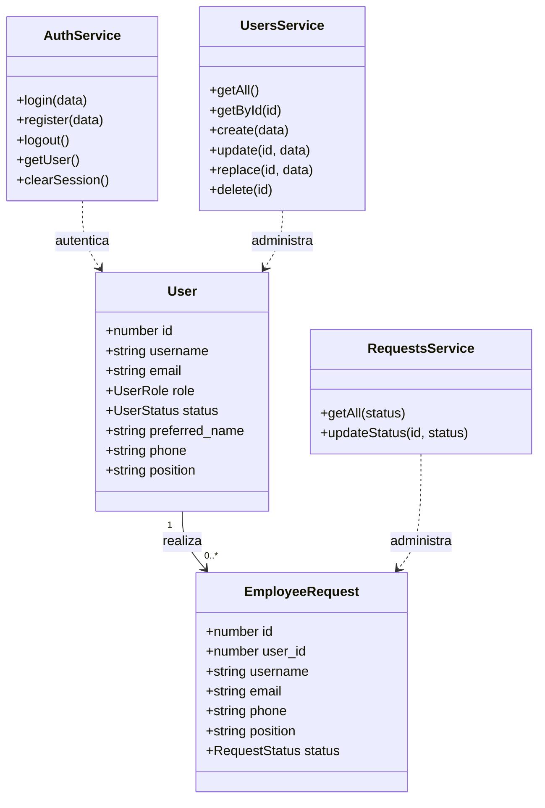

# Sistema de Recursos Humanos

## 1. Descripción general

La aplicación es una pequeña aplicación móvil/web de Recursos Humanos construida con Ionic, Angular, TypeScript y Capacitor. El sistema maneja dos perfiles principales:

- **Empleado (`user`)**: consulta y actualiza su información personal, puesto y estado.
- **RH (`admin`)**: consulta empleados, revisa solicitudes y acepta o rechaza nuevos registros.

La autenticación se realiza mediante la API PHP. El token de sesión se guarda localmente y el campo `role` determina el acceso a las funciones administrativas.

## 2. Modelo de datos

### Entidad `users`

Representa a los empleados y administradores del sistema.

| Campo | Tipo | Descripción |
|---|---|---|
| `id` | INT | Identificador único. |
| `username` | VARCHAR(50) | Nombre de acceso. |
| `email` | VARCHAR(120) | Correo electrónico único. |
| `password_hash` | VARCHAR(255) | Contraseña almacenada como hash. |
| `preferred_name` | VARCHAR(100) | Nombre que prefiere mostrar el usuario. |
| `phone` | VARCHAR(30) | Teléfono de contacto. |
| `position` | VARCHAR(100) | Puesto: Ingeniero, Mantenimiento, Multifuncional, etc. |
| `role` | ENUM | `admin`, `moderator` o `user`. |
| `status` | ENUM | `active`, `inactive` o `blocked`. |
| `api_token` | CHAR(64) | Token de sesión almacenado con hash. |
| `created_at` / `updated_at` | TIMESTAMP | Fechas de creación y actualización. |

### Entidad `employee_requests`

Representa una solicitud de ingreso pendiente de revisión por RH.

| Campo | Tipo | Descripción |
|---|---|---|
| `id` | INT | Identificador de la solicitud. |
| `user_id` | INT | Usuario relacionado. |
| `username` | VARCHAR(50) | Usuario que realizó la solicitud. |
| `email` | VARCHAR(120) | Correo solicitado. |
| `phone` | VARCHAR(30) | Teléfono opcional. |
| `position` | VARCHAR(100) | Puesto solicitado, si se proporciona. |
| `message` | VARCHAR(500) | Comentario opcional. |
| `status` | ENUM | `pending`, `approved` o `rejected`. |
| `created_at` / `reviewed_at` | TIMESTAMP | Fechas de creación y revisión. |

Relación principal: un registro de `users` puede tener una o más solicitudes en `employee_requests`. La clave foránea `user_id` mantiene la relación y elimina las solicitudes si se elimina el usuario.

## 3. Interfaces TypeScript

Las interfaces compartidas se encuentran en [src/app/models/hr.models.ts](src/app/models/hr.models.ts).

```typescript
export type UserRole = 'admin' | 'moderator' | 'user';
export type UserStatus = 'active' | 'inactive' | 'blocked';
export type RequestStatus = 'pending' | 'approved' | 'rejected';

export interface User {
  id: number;
  username: string;
  email: string;
  role: UserRole;
  status: UserStatus;
  preferred_name?: string | null;
  phone?: string | null;
  position?: string | null;
}

export interface EmployeeRequest {
  id: number;
  user_id?: number;
  username: string;
  email: string;
  phone?: string | null;
  position?: string | null;
  message?: string | null;
  status: RequestStatus;
}
```

También se definen contratos para `LoginRequest`, `RegisterRequest`, `AuthResponse`, `UsersResponse`, `UserResponse`, `UserUpdate` y `RequestsResponse`.

## 4. Servicios de acceso a datos

| Servicio | Responsabilidad | API utilizada |
|---|---|---|
| `AuthService` | Login, registro, logout, token y sesión local. | `login.php`, `register.php`, `logout.php` |
| `UsersService` | Consulta y mantenimiento de usuarios. | `users.php` |
| `RequestsService` | Consulta y actualización de solicitudes. | `requests.php` |

Los servicios utilizan Axios para las peticiones HTTP y devuelven `Observable` de RxJS. El token se envía mediante el encabezado `Authorization: Bearer ...`.

## 5. Guía rápida para localizar el backend

Esta sección sirve como mapa de lectura cuando se necesita encontrar dónde se declara, almacena o consume cada dato.

### 5.1 Interfaces: declaración y consumo

Las interfaces no se declaran dentro de los componentes ni dentro de PHP. Se concentran en [src/app/models/hr.models.ts](src/app/models/hr.models.ts):

| Contrato | Se declara en | Se consume principalmente en | Propósito |
|---|---|---|---|
| `User` | `hr.models.ts` | `AuthService`, `UsersService`, `tab2.page.ts`, `tab3.page.ts` | Usuario, empleado o administrador. |
| `LoginRequest` | `hr.models.ts` | `login.page.ts`, `tab1.page.ts`, `AuthService.login()` | Datos enviados al login. |
| `RegisterRequest` | `hr.models.ts` | `register.page.ts`, `login.page.ts`, `AuthService.register()` | Datos enviados al registro. |
| `AuthResponse` | `hr.models.ts` | `AuthService`, pantallas de login | Respuesta con `success`, mensaje, token y usuario. |
| `UserUpdate` | `hr.models.ts` | `UsersService.update()`, perfil y panel de RH | Campos modificables mediante `PATCH`. |
| `EmployeeRequest` | `hr.models.ts` | `RequestsService`, `requests.page.ts` | Solicitud de ingreso de empleado. |
| `UsersResponse` / `UserResponse` | `hr.models.ts` | `UsersService`, `tab2.page.ts`, `tab3.page.ts` | Respuestas de consulta de usuarios. |
| `RequestsResponse` | `hr.models.ts` | `RequestsService`, `requests.page.ts` | Respuesta de solicitudes pendientes o revisadas. |

Ejemplo de consumo tipado:

```typescript
update(id: number, data: UserUpdate): Observable<UserResponse> {
  return from(
    axios.patch<UserResponse>(`${this.url}?id=${id}`, data, {
      headers: this.headers()
    }).then(response => response.data)
  );
}
```

El tipo de Axios (`axios.patch<UserResponse>`) describe la respuesta HTTP; `Observable<UserResponse>` es el formato que reciben los componentes Angular.

### 5.2 Capas del backend

```text
Pantalla Angular
  -> Servicio TypeScript
     -> Axios
        -> Endpoint PHP
           -> PDO
              -> MySQL (ionic_app)
```

| Capa | Ubicación | Responsabilidad |
|---|---|---|
| Pantallas | `src/app/login`, `src/app/tab2`, `src/app/tab3`, `src/app/requests` | Capturan acciones y muestran resultados. |
| Servicios | `src/app/services/` | Construyen URLs, headers y peticiones Axios. |
| Modelos | `src/app/models/hr.models.ts` | Definen la forma esperada de los datos. |
| API | `php-api/*.php` | Valida entrada, autoriza y ejecuta operaciones. |
| Conexión | `php-api/config.php` | Crea la conexión PDO a MySQL. |
| Base de datos | `database.sql` | Declara tablas, enums, índices y relación entre entidades. |

## 6. Almacenamiento, sesión y cache

### 6.1 Sesión de autenticación

La sesión del usuario no se guarda en MySQL como texto plano ni en una cache HTTP:

- `AuthService.login()` guarda el token en `localStorage` con la clave `token`.
- El usuario público se guarda en `localStorage` con la clave `auth_user`.
- `AuthService.token()` recupera el token para los servicios protegidos.
- `AuthService.getUser()` recupera el usuario para guards y componentes.
- `AuthService.clearSession()` elimina ambas claves al cerrar sesión.

El backend guarda únicamente el hash SHA-256 del token en `users.api_token`. El token original viaja solo en la petición como:

```text
Authorization: Bearer <token>
```

El token expira después de 7 días. La validación se realiza en [php-api/_common.php](php-api/_common.php), mediante `requireAuth()`.

### 6.2 Cache de fotografías

La galería original utiliza otro almacenamiento, independiente de usuarios y empleados:

- [src/app/services/photo.service.ts](src/app/services/photo.service.ts) guarda el listado de referencias con `Preferences` usando la clave `photos`.
- El archivo de imagen se guarda con `Filesystem` en `Directory.Data`.
- `loadSaved()` recupera las referencias y reconstruye las rutas para mostrarlas.
- `deletePhoto()` actualiza `Preferences` y elimina el archivo físico.

Por tanto, la aplicación no tiene una cache propia de respuestas Axios. Tiene sesión local para autenticación y almacenamiento local de fotografías.

### 6.3 Configuración de base de datos

[php-api/config.php](php-api/config.php) lee estas variables de entorno:

```text
DB_HOST  (por defecto 127.0.0.1)
DB_NAME  (por defecto ionic_app)
DB_USER  (por defecto root)
DB_PASS  (por defecto vacío)
```

La conexión usa PDO, excepciones para errores, resultados asociativos y consultas preparadas.

## 7. Endpoints y método de uso

La URL base del frontend se define en [src/environments/environment.ts](src/environments/environment.ts) mediante `environment.apiUrl`. En desarrollo local es `http://localhost/Agente/php-api`.

| Endpoint | Método | Servicio o pantalla que lo consume | Uso |
|---|---|---|---|
| `login.php` | POST | `AuthService.login()` | Valida usuario o correo, genera token y devuelve usuario. |
| `register.php` | POST | `AuthService.register()` | Crea usuario `inactive` y solicitud `pending`. |
| `logout.php` | POST | `AuthService.logout()` | Invalida el token guardado en MySQL. |
| `users.php` | GET | `UsersService.getAll()` | Lista usuarios para RH. |
| `users.php?id=ID` | GET | `UsersService.getById()` | Consulta un usuario autorizado. |
| `users.php` | POST | `UsersService.create()` | Crea un usuario activo desde una operación administrativa. |
| `users.php?id=ID` | PATCH | `UsersService.update()` | Actualiza perfil, puesto, teléfono, estado o rol según permisos. |
| `users.php?id=ID` | PUT | `UsersService.replace()` | Reemplaza datos básicos requeridos. |
| `users.php?id=ID` | DELETE | `UsersService.delete()` | Elimina el usuario; la solicitud relacionada se elimina por la FK. |
| `requests.php?status=pending` | GET | `RequestsService.getAll()` | Lista solicitudes para RH. |
| `requests.php?id=ID` | PATCH | `RequestsService.updateStatus()` | Aprueba o rechaza una solicitud y actualiza el estado del usuario. |

Ejemplo de flujo de modificación:

```text
tab2.page.html
  -> tab2.page.ts: updatePosition(employee, position)
     -> UsersService.update(id, { position })
        -> PATCH /users.php?id=ID
           -> requireAuth($pdo)
           -> UPDATE users SET position = ...
           -> UserResponse
```

## 8. Axios: ubicación y uso

Axios se importa únicamente en los servicios que consumen la API:

- [src/app/services/auth.service.ts](src/app/services/auth.service.ts)
- [src/app/services/users.service.ts](src/app/services/users.service.ts)
- [src/app/services/requests.service.ts](src/app/services/requests.service.ts)

Patrones usados:

```typescript
axios.get<ResponseType>(url, { headers })
axios.post<ResponseType>(url, body)
axios.patch<ResponseType>(url, body, { headers })
axios.delete<ResponseType>(url, { headers })
```

Cada promesa se convierte a RxJS con `from(...)`, por lo que los componentes consumen con `subscribe({ next, error })`. Las peticiones protegidas construyen el header mediante el método privado `headers()` de cada servicio.

## 9. CORS y preflight

La entrada común de la API está en [php-api/_common.php](php-api/_common.php):

- Define `Content-Type: application/json`.
- Responde `204 No Content` a peticiones `OPTIONS` de preflight.
- Expone las funciones compartidas `getJsonInput()`, `jsonResponse()`, `bearerToken()` y `requireAuth()`.

En el entorno XAMPP actual, Apache agrega las cabeceras CORS:

```text
Access-Control-Allow-Origin: *
Access-Control-Allow-Headers: Content-Type, Authorization, X-Requested-With
Access-Control-Allow-Methods: GET, POST, PUT, PATCH, DELETE, OPTIONS
```

No se deben duplicar esas cabeceras desde PHP. En producción se debe reemplazar `*` por el origen real del frontend y mantener HTTPS.

Si una petición falla antes de llegar al endpoint, revisar primero:

1. Que la URL de `environment.apiUrl` sea accesible desde el dispositivo.
2. Que Apache responda el `OPTIONS` con las cabeceras anteriores.
3. Que el header `Authorization` no sea eliminado por el servidor.
4. Que el token siga vigente y corresponda a un usuario `active`.

## 10. Flujo completo de una solicitud



## 11. Operaciones CRUD básicas

### Usuarios

| Operación | Método | Servicio | Endpoint | Permiso |
|---|---|---|---|---|
| Crear | POST | `UsersService.create()` | `users.php` | API protegida según configuración |
| Consultar todos | GET | `UsersService.getAll()` | `users.php` | RH (`admin`) |
| Consultar uno | GET | `UsersService.getById(id)` | `users.php?id=id` | Usuario propio o RH |
| Actualizar parcialmente | PATCH | `UsersService.update()` | `users.php?id=id` | Usuario propio; RH puede actualizar puesto, rol y estado |
| Reemplazar datos básicos | PUT | `UsersService.replace()` | `users.php?id=id` | Usuario autorizado |
| Eliminar | DELETE | `UsersService.delete()` | `users.php?id=id` | RH puede eliminar desde Inicio; no puede eliminar su propia cuenta |

### Solicitudes

| Operación | Método | Servicio | Endpoint | Permiso |
|---|---|---|---|---|
| Crear solicitud | POST | Registro público | `register.php` | Visitante no autenticado |
| Consultar pendientes | GET | `RequestsService.getAll()` | `requests.php?status=pending` | RH (`admin`) |
| Aprobar o rechazar | PATCH | `RequestsService.updateStatus()` | `requests.php?id=id` | RH (`admin`) |

Cuando un usuario se registra, se crea una cuenta `inactive` y una solicitud `pending`. Al aprobarla, la cuenta pasa a `active`; al rechazarla, pasa a `blocked`.

## 12. Navegación y permisos

```text
/login
   |
   +--> /tabs/tab2       Inicio
   |       |
   |       +--> /tabs/tab3       Mi perfil (empleado y RH)
   |       |
   |       +--> /tabs/requests  Solicitudes (solo admin)
   |
   +--> Sin sesión: no se permite acceder a /tabs
```

Los guards están en [src/app/services/auth.guard.ts](src/app/services/auth.guard.ts):

- `authGuard`: exige una sesión iniciada.
- `adminGuard`: exige `user.role === 'admin'`.

## 13. Diagrama de entidades y clases



## 14. Código fuente actualizado en Git

Los archivos SQL, PHP, Angular y TypeScript forman parte del repositorio Git del proyecto. Los cambios principales están organizados en:

- `database.sql` y `database_migration.sql`: estructura de base de datos.
- `php-api/`: endpoints de autenticación, usuarios y solicitudes.
- `src/app/models/`: interfaces compartidas.
- `src/app/services/`: acceso a datos y autenticación.
- `src/app/*`: pantallas de inicio, perfil, empleados y solicitudes.

Para preparar la entrega se puede consultar el estado con:

```bash
git status
git diff --check
git diff
```

No se incluye un commit automático para que el responsable del proyecto pueda revisar y nombrar el commit de acuerdo con las reglas de su repositorio.

## 15. Uso de inteligencia artificial

La IA se utilizó como herramienta de apoyo durante el desarrollo, no como sustituto de la revisión humana. El proceso fue:

1. Se inspeccionaron las rutas, componentes, servicios, endpoints PHP y archivos SQL existentes.
2. Se identificaron las reglas de negocio: `admin` representa a RH y `user` representa a un empleado.
3. Se propuso y revisó el modelo de datos para usuarios, puestos, estados y solicitudes.
4. Se generaron ajustes de código para guards, interfaces, servicios y endpoints.
5. Se revisaron los cambios con compilación de Angular, análisis de sintaxis PHP y `git diff --check`.
6. Se corrigieron errores detectados por el compilador, como el alcance de una referencia de plantilla.

La validación final corresponde al equipo desarrollador: debe ejecutarse la migración SQL, probar el login con un administrador y verificar manualmente el flujo de registro, aprobación, rechazo, edición de perfil y asignación de puesto.

## 16. Preparación y validación

1. Ejecutar `database.sql` en una instalación nueva o `database_migration.sql` en una instalación existente.
2. Configurar la conexión en `php-api/config.php`.
3. Instalar dependencias con `npm install`.
4. Iniciar Angular con `npm start`.
5. Verificar que el administrador pueda entrar a Solicitudes y Empleados.
6. Ejecutar `npm run build` para comprobar la compilación.
